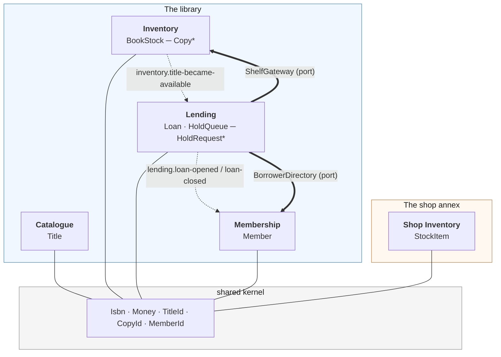

# Municipal Library

An educational showcase of Domain-Driven Design, built around a public library
that lends physical books — and a small shop annex that sells them.

There is no web server, no database and no framework. Every idea in the
repository is demonstrated by a **runnable script** that narrates what it is
doing and why, and pinned by a **test** that fails if the idea stops being true.

```bash
pnpm install
pnpm scenarios          # run all six walkthroughs
pnpm test               # 66 tests, all of them about the model
```

---

## Why a library?

The target modelled business was about _book reservation, stocks and inventory management_. A lending
library is the sharpest version of that problem, because it forces a distinction
most inventory systems get to avoid: _the library must know **which copy** you have at home_.

A bookshop does not. A customer buying _Dune_ does not care which of the four
boxed copies they receive, and the shop has no reason to track it. That single
difference produces two completely different models of the word "stock" — and
that contrast is the spine of this repository.

The shop annex exists in `packages/bookshop/` purely to make the comparison
concrete. Read [`docs/06-two-models-of-stock.md`](docs/06-two-models-of-stock.md)
for the argument.

---

## The business

**The library** lends physical volumes to members holding a card.

- A member reserves a **title**, not a copy — you cannot ask for barcode
  `LIB-000102` — and joins a queue.
- When a copy comes back, the front of the queue is allocated it and has
  **48 hours** to collect. Uncollected holds lapse and pass to the next member.
- A loan runs for **21 days**. Overdue loans are announced by a nightly sweep.
- Volumes are damaged, repaired, lost and withdrawn. Each has a lifecycle that
  the model refuses to let you shortcut.
- Borrowing allowance depends on the card: Child 3, Adult 8, Staff 20.

**The shop annex** sells paperbacks. Stock is a quantity. Customers can reserve
units for collection. The only rule is that the shop never promises more copies
than it holds.

### Ubiquitous language

The vocabulary is deliberate, and the code uses these words and no others.

| Term           | Means                                                       | Explicitly **not**          |
| -------------- | ----------------------------------------------------------- | --------------------------- |
| **Title**      | A work in the catalogue: _Dune_, Frank Herbert, 1965        | a physical object           |
| **Copy**       | One physical volume, identified by the barcode in its cover | a title                     |
| **Stock**      | All the copies of one title                                 | a quantity (in the library) |
| **Member**     | A person holding a library card                             | a "user"                    |
| **Loan**       | One volume, in one member's hands, until a due date         | a "borrow record"           |
| **Hold**       | A member's place in the queue for a title                   | a "reservation of a copy"   |
| **Allocation** | A returned copy set aside for a specific member             | a loan                      |
| **Product**    | A line of shop stock                                        | a Title                     |

The word **"book" is banned**, because a librarian uses it for two different
things — "we have that book" (the work) and "this book is damaged" (the volume).
Modelling both as one class is how you end up with a system where nobody can say
what `book.damaged` means.

---

## Context map



`*` = child entity, living inside its aggregate root's boundary.

Dotted arrows are **domain events**. Thick arrows are **ports** that Lending
declares and the composition root implements. There are no other connections:
no bounded context imports another, and `tsc -b` enforces it, because the
contexts do not list each other as dependencies.

---

## The aggregates

| Aggregate root | Context    | Children      | The invariant it exists to protect                                                      |
| -------------- | ---------- | ------------- | --------------------------------------------------------------------------------------- |
| `Title`        | Catalogue  | —             | heading, author and a plausible publication year                                        |
| `BookStock`    | Inventory  | `Copy`        | **`availableCount` always equals the copies on the shelf**                              |
| `Member`       | Membership | —             | a member never has a negative number of loans                                           |
| `Loan`         | Lending    | —             | falls due after it was opened; not returned before borrowed                             |
| `HoldQueue`    | Lending    | `HoldRequest` | one place per member · collect-by exactly for allocations · **ordered by request time** |
| `StockItem`    | Shop       | —             | reserved never exceeds on hand                                                          |

Two of these have children, and both were given them for the same reason: a rule
that must hold across several objects _at every instant_. That criterion — and
nothing else — is what draws an aggregate boundary. See
[`docs/02-aggregate-root.md`](docs/02-aggregate-root.md).

---

## The scenarios

Each is a standalone script that prints a narrated transcript.

|     | Command           | Shows                                                                                        |
| --- | ----------------- | -------------------------------------------------------------------------------------------- |
| 1   | `pnpm scenario:1` | Value Objects that cannot be invalid; events fired on _edges_, not on every change           |
| 2   | `pnpm scenario:2` | One aggregate per transaction; a counter kept in step by an event; a time-driven use case    |
| 3   | `pnpm scenario:3` | The hold queue: a second root with children, ordering as an invariant, an injected policy    |
| 4   | `pnpm scenario:4` | Every rule attacked — **and an aggregate deliberately broken** by reaching past its boundary |
| 5   | `pnpm scenario:5` | **Can an entity emit a domain event?** The question this repo was built to answer            |
| 6   | `pnpm scenario:6` | The same word "stock", modelled two irreconcilable ways, both correct                        |

Start with **5** if you came here from the StackOverflow threads in `CLAUDE.md`.
Start with **1** if you want the story in order.

---

## The documentation

Readable here on GitHub, or as a site:

```bash
pnpm docs:dev          # http://localhost:4321
pnpm docs:build        # static build into apps/docs/dist/
```

The site is Astro + Starlight, and it reads the files below **in place** — they
are never copied, and they carry no frontmatter, so the version you are reading
now is the only version. `apps/docs/src/content.config.ts` derives each page's
title from its `#` heading and its description from the blockquote beneath it.

It also adds a **Scenarios** section holding the real console output of each
runnable script, captured on every build so it cannot drift from the code, and a
**Playground** that runs the real `BookStock` aggregate in the browser — lend
copies, watch events fire on availability _edges_, and break the boundary on
purpose to see how long a corrupt aggregate stays invisible.

One rough edge: because the documents live outside the app, the dev server does
not notice when you edit one — restart `pnpm docs:dev` to see the change.
Builds always reflect the current files.

Written to be read in this order, but each stands alone.

1. [Entity](docs/01-entity.md) — identity, and why it is not an `id` column
2. [Aggregate Root](docs/02-aggregate-root.md) — the consistency boundary, and how big it should be
3. [Entity vs Aggregate Root](docs/03-entity-vs-aggregate.md) — the relationship, the difference, and how to decide
4. [Invariants](docs/04-invariants.md) — what is and is not one, and where each kind belongs
5. [Domain events](docs/05-domain-events.md) — **the motivating question**, answered against the linked debates
6. [Two models of stock](docs/06-two-models-of-stock.md) — bounded contexts made concrete
7. [Architecture](docs/07-architecture.md) — the monorepo, the layers, and what the compiler actually enforces

---

## Repository layout

```
packages/
  ddd-core/            Entity · AggregateRoot · ValueObject · DomainEvent · Identifier
  shared-kernel/       Isbn · Money · TitleId · CopyId · MemberId
  event-bus/           the hand-rolled pub/sub + UnitOfWork (dispatch after commit)
  library/
    catalog/           Title
    inventory/         BookStock ─ Copy          ← the showcase aggregate
    membership/        Member
    lending/           Loan · HoldQueue ─ HoldRequest
  bookshop/
    inventory/         StockItem                 ← the contrast
  composition/         wiring.ts — the one place the contexts meet
apps/
  scenarios/           six narrated scripts — a terminal over the composition
  docs/                Astro + Starlight site — a browser over the same one
tests/                 66 tests against the published surface of each context
docs/                  the concepts, in prose
```

`packages/composition` is a package rather than part of an app because there are
two ways to drive this model and only one way it is wired. It compiles with
`"types": []`, so `console` and `process` are build errors inside it — which is
what lets the browser playground run the real aggregates rather than a copy.

Inside every context: `domain/` (the model and its interfaces), `application/`
(use cases, one aggregate each), `infrastructure/` (implementations). Only
`index.ts` is importable from outside — which is how `Copy` and `HoldRequest`
are kept unreachable, since TypeScript has no package-private modifier.

---

## Two places to make your own call

Both ship with a working default, clearly marked `👉 YOUR CALL`, and both are
real design decisions rather than exercises:

- **`packages/library/lending/src/domain/hold-allocation-policy.ts`** — whose
  turn is it when a copy comes back? Strict FIFO is implemented;
  skip-the-ineligible is provided as a worked alternative. Write your own
  `HoldAllocationPolicy` (≈8 lines) and pass it to `HoldDesk`;
  `tests/hold-queue.test.ts` will show you exactly which behaviour changed.

- **`packages/library/membership/src/domain/member.ts`**, in `loanTaken()` —
  what should happen when a race pushes a member past their allowance? The
  current answer records `BorrowAllowanceExceeded` and carries on. Two other
  defensible answers are documented in place, with why one of them is a trap.

---

## Conventions worth knowing before you read the code

- **`#private` fields, not `private`.** Encapsulation enforced by the runtime,
  not just by the compiler. A subclass cannot reach into an event buffer.
- **Named constructors.** `Title.register(...)` records that it happened;
  `Title.rehydrate(...)` reconstructs from storage and deliberately records
  nothing. You cannot reconstruct an aggregate and accidentally re-announce
  a decade-old event.
- **No aggregate ever calls `new Date()` or `randomUUID()`.** Time arrives as a
  `Clock`, ids as an `IdentifierFactory`. Both are business inputs here, and
  both make the model deterministic.
- **Aggregates reference each other by id, never by object.** A `Loan` holds a
  `MemberId`, never a `Member`.
- **Snapshots out, never entities.** Public methods return inert data.
- **`DomainError` ≠ `InvariantViolation`.** The first is the business saying no
  — print it at the counter. The second means the model has a bug.
