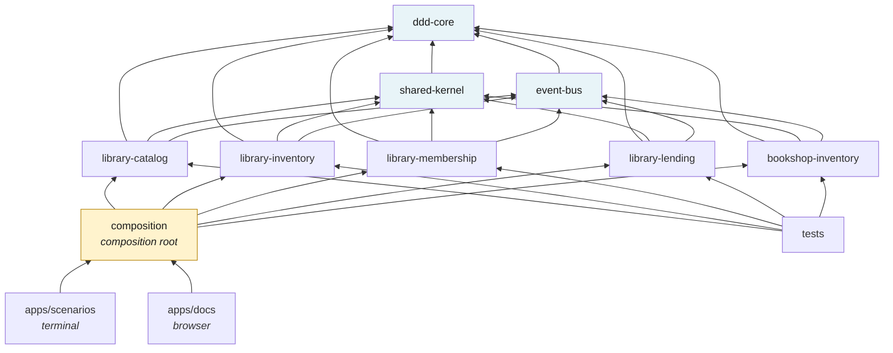

# Architecture

> Which boundaries are enforced by the compiler, which by convention, and which
> only by a comment — stated honestly, because the difference matters.

---

## Two boundaries, two mechanisms

### Between contexts: package boundaries (compiler-enforced)

Each bounded context is a workspace package, and **no context lists another as a
dependency**:

```jsonc
// packages/library/lending/package.json
"dependencies": {
  "@local/ddd-core":      "workspace:*",
  "@local/event-bus":     "workspace:*",
  "@local/shared-kernel": "workspace:*"
  // no library-inventory. no library-membership.
}
```

An `import { BookStock } from '@local/library-inventory'` inside Lending does
not resolve — pnpm's strict `node_modules` layout means it is not there — and
`tsc -b` fails because the project reference is absent. This is a build error,
not a lint warning, and it does not depend on anyone reviewing the diff.

Verify it yourself:

```bash
grep -rn "from '@local/library-\|from '@local/bookshop-" packages/ | grep -v /dist/
# (no output — no bounded context imports another)
```

### Inside a context: layers (convention + the export list)

Each context has `domain/`, `application/`, `infrastructure/` as folders, with
`index.ts` publishing a curated surface. The rule — domain never imports
infrastructure — is convention, and I will not pretend otherwise.

The alternative was a package per layer per context (`lending-domain`,
`lending-application`, …), which *would* make the layering a compile error. It
would also mean about 15 packages and three times the `package.json`
boilerplate. For a teaching repository the added ceremony would obscure the
model, so the trade was made deliberately rather than by omission. In a
production codebase where the layering is being violated in review, splitting is
the right answer.

What *is* enforced is the export list, and it does the most important work:

```ts
// packages/library/inventory/src/index.ts
export { BookStock } from './domain/book-stock.js'
export type { CopySnapshot } from './domain/copy.js'
// `Copy` is deliberately absent
```

TypeScript has no package-private modifier, so **the export list is the access
modifier**. `Copy` and `HoldRequest` have entirely public methods — their roots
must call them — but no code outside their package can obtain a reference, so
publicness never gets the chance to matter.

---

## The dependency graph



Note what is **not** there: no arrow between any two contexts. The graph is a
tree, and `tsc -b` will refuse to build a cycle into it.

---

## `ddd-core` is not the shared kernel

A distinction worth being pedantic about, because conflating them is how shared
kernels turn into dumping grounds.

| | Contains | Changing it means |
|---|---|---|
| **`ddd-core`** | `Entity`, `AggregateRoot`, `ValueObject`, `DomainEvent` | a technical library upgrade |
| **`shared-kernel`** | `Isbn`, `Money`, `TitleId`, `CopyId`, `MemberId` | **every team sharing it must agree** |

A shared kernel is a slice of *model* that two teams both own and neither may
change alone. That is a real organisational cost, so the bar for adding to it is
"more than one context genuinely needs to refer to this".

`LoanId` and `HoldRequestId` are therefore in `@local/library-lending`, not in
the kernel: no other context has any business naming a loan.

---

## The composition root

`packages/composition/src/wiring.ts` is the only file that imports more than one
bounded context. Everything crossing a border is one of two things:

**1. An adapter implementing a port the consuming context declared.**

```ts
class ShelfAdapter implements ShelfGateway {
  async lendAnyCopy(titleId: TitleId): Promise<CopyId | undefined> {
    try {
      return await this.#shelf.lendAnyCopy(titleId)
    } catch (error) {
      if (error instanceof NoCopyAvailable) return undefined   // ← the ACL
      throw error
    }
  }
}
```

That `catch` is the anti-corruption layer doing real work. Inventory signals
"nothing on the shelf" by throwing; Lending's port says the answer is
`undefined`. Translating here means Lending never learns that Inventory has an
exception type by that name — and **catching a foreign exception type in
business code is an import in disguise**, which promotes someone else's error
class into your contract without anybody deciding to.

**2. A subscription.**

```ts
bus.on(TitleBecameAvailable, async (event) => {
  await holdDesk.allocateOnAvailability(TitleId.of(event.titleId))
})
```

Read as a sentence: *when a title becomes available, the hold desk allocates it.*
Inventory does not know a queue exists. Adding a second reaction — print a slip,
email the member — means adding a subscriber here and changing nothing in
Inventory.

---

## Layers inside a context

```
domain/           the model, and the interfaces it needs stated in its own words
  ├─ entities, aggregates, value objects
  ├─ domain events
  ├─ repository interfaces          ← the interface, not the implementation
  └─ policies                       ← e.g. HoldAllocationPolicy

application/      use cases. Thin, by design.
  ├─ one aggregate changed per transaction
  ├─ ports for other contexts       ← ShelfGateway, BorrowerDirectory
  └─ no business rules

infrastructure/   implementations of the interfaces above
  └─ InMemory* repositories
```

An application service does four things and nothing else: translate primitives
into domain types, load what is needed, call **one** method on **one** aggregate,
commit.

Rules that live in application services cannot be unit-tested without a
repository, cannot be found by a domain expert reading the model, and get
duplicated the moment a second entry point appears.

There is one honest exception, and it is worth understanding rather than hiding:

```ts
// packages/library/catalog/src/application/register-title.ts
const existing = await this.#titles.findByIsbn(isbn)
if (existing !== undefined) throw new InvariantViolation(
  'an ISBN identifies at most one catalogue title', /* … */)
```

"No two titles share an ISBN" is a rule *across* aggregates. No `Title` can
enforce it, because no `Title` can see the others. Set-wide rules necessarily
live at this level — or in a database unique constraint, which is the honest
place for them.

---

## Determinism as a design constraint

No aggregate anywhere calls `new Date()` or `randomUUID()`.

```ts
export interface Clock { now(): Date }
export interface IdentifierFactory {
  nextLoanId(): string
  nextHoldRequestId(): string
}
```

Time is a *business input* in this domain — loans fall due, holds expire after
48 hours, suspensions lapse. A model that reaches for the clock internally
cannot be tested, and worse, cannot be *reasoned about*: "what happens on the day
the hold expires?" becomes an experiment rather than a question.

The scenarios drive a `FixedClock` by hand (`clock.advanceDays(25)`) and mint
sequential ids, so every transcript is byte-identical between runs — diffable,
and a behavioural change shows up in review instead of hiding in noise.

---

## The toolchain, and why

| Choice | Reason |
|---|---|
| **pnpm workspaces** | strict `node_modules`: an undeclared dependency does not resolve, which is what makes the context boundary real rather than aspirational |
| **TypeScript project references** | `composite: true` turns the package graph into something `tsc -b` verifies; a cycle is a build failure |
| **`moduleResolution: NodeNext`** | explicit `.js` extensions on relative imports — mildly irritating, and the honest ESM story Node actually runs |
| **`exactOptionalPropertyTypes`** | stops `{ returnedAt: undefined }` passing where "this loan has no return date" should be a distinct modelled state |
| **`noUncheckedIndexedAccess`** | `array[0]` is `T \| undefined`, which is true, and which matters when the array is a queue |
| **No linter** | `tsc --strict` catches what matters here; a lint config would be one more thing to read before reaching the model |
| **Vitest** | the tests import from `dist`, so they exercise each context's *published* surface — the same surface another context would see |

`pnpm test` runs `tsc -b` first, deliberately: if `Copy` accidentally became
exported, the type tests would start passing for the wrong reason.

---

## What this repository is not

Being explicit, since it is a teaching artefact:

- **No persistence.** `InMemoryRepository` is a `Map`. Real repositories bring
  optimistic concurrency, which is where aggregate boundaries stop being a
  design opinion and start being a lock.
- **No transactional outbox.** `UnitOfWork` publishes in-process after saving.
  The remaining crash window is described in [document 5](05-domain-events.md).
- **No true concurrency.** The event bus dispatches sequentially so transcripts
  are deterministic. Races are *described* in the code (`BorrowBook`'s
  `#copiesSetAsideForOthers`) rather than exercised.
- **`unsafeCopyForTeaching()`** is a hole in an aggregate boundary that exists
  solely so scenario 4 can break the invariant for real. Delete it and the only
  thing that stops working is the lesson.

---

## Where to look in the code

| | |
|---|---|
| Package graph | `tsconfig.json`, `pnpm-workspace.yaml` |
| Composition root | `packages/composition/src/wiring.ts` |
| Ports (the ACL) | `packages/library/lending/src/application/ports.ts` |
| A published surface | `packages/library/inventory/src/index.ts` |
| Compiler settings | `tsconfig.base.json` |

---

**Previous:** [← Two models of stock](06-two-models-of-stock.md) · **Back to** [README](../README.md)
